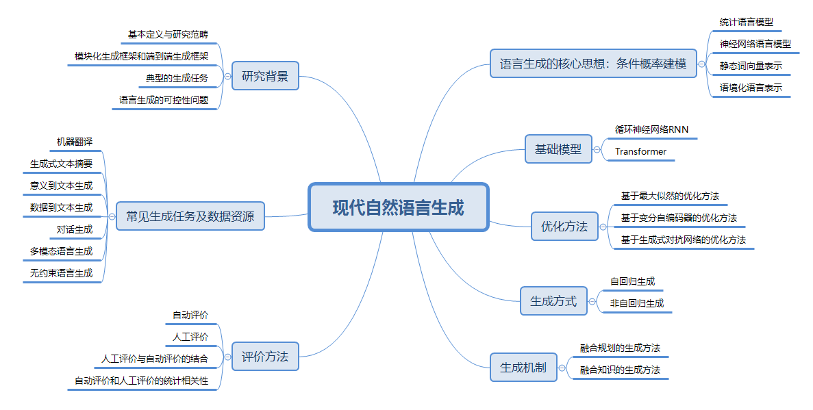

# 新书《现代自然语言生成》


### 内容简介

Keywords: 循环神经网络、Transformer、变分自编码器、生成式对抗网络、序列到序列模型、统计语言模型、神经语言模型、非自回归生成、知识融合、语言生成评价

本书总结了以神经网络为代表的现代自然语言生成的基本思想、模型和框架。本书共12章，首先介绍了自然语言生成的研究背景、从统计语言模型到神经网络语言建模的过程，以及自然语言建模的思想与技术演化过程；其次从基础模型角度介绍了基于循环神经网络、基于Transformer 的语言生成模型，从优化方法角度介绍了基于变分自编码器、基于生成式对抗网络的语言生成模型，从生成方式角度介绍了非自回归语言生成的基本模型和框架；然后介绍了融合规划的自然语言生成、融合知识的自然语言生成、常见的自然语言生成任务和数据资源，以及自然语言生成的评价方法；最后总结了本书的写作思路及对自然语言生成领域未来发展趋势的展望。 本书可作为高等院校计算机科学与技术、人工智能、大数据等相关专业高年级本科生、研究生相关课程的教材，也适合从事自然语言处理研究、应用实践的科研人员和工程技术人员参考。  



### 目录

我们提供部分试读，点击下方链接下载：

* [序](https://github.com/thu-coai/NLG_book/raw/master/preface1.pdf)（中国科学院院士 清华大学教授 张钹院士 为本书作序）
* [前言](https://github.com/thu-coai/NLG_book/raw/master/preface2.pdf)
* [第一章](https://github.com/thu-coai/NLG_book/raw/master/chapter1.pdf)

```
第1章 自然语言生成的研究背景
    1.1 自然语言生成的背景概述
    1.2 基本定义与研究范畴
    1.3 自然语言生成与自然语言理解.
    1.4 传统的模块化生成框架
    1.5 端到端的自然语言生成框架
    1.6 典型的自然语言生成任务
    1.7 自然语言生成的可控性
    1.8 本书结构
第2章 从统计语言模型到神经网络语言建模
    2.1 统计语言模型
        2.1.1 基本原理
        2.1.2 平滑技术
        2.1.3 语言模型评价
        2.1.4 统计语言模型的缺点
    2.2 神经网络语言模型
        2.2.1 前馈神经网络语言模型
        2.2.2 基于循环神经网络的神经语言模型
        2.2.3 基于Transformer 的神经语言模型
    2.3 静态词向量模型
        2.3.1 分布假设与分布式表示
        2.3.2 词向量模型CBOW 和Skip-gram
        2.3.3 词向量模型训练优化：负采样
        2.3.4 词向量模型训练优化：层次化softmax 
        2.3.5 静态词向量的缺陷
    2.4 语境化语言表示模型
        2.4.1 ELMo 
        2.4.2 BERT 
        2.4.3 XLNet
    2.5 本章小结
第3章 基于RNN 的语言生成模型
    3.1 RNN 的基本原理
    3.2 RNN 的训练算法
    3.3 长短期记忆神经网络与门控循环单元
    3.4 RNN 的架构设计
        3.4.1 多层RNN 
        3.4.2 双向RNN 
    3.5 基于RNN 的语言模型
        3.5.1 模型结构
        3.5.2 主要问题
        3.5.3 模型改进
    3.6 序列到序列模型
        3.6.1 基本原理
        3.6.2 模型结构
        3.6.3 注意力机制
    3.7 解码器的解码方法
        3.7.1 基于搜索的解码方法
        3.7.2 基于采样的解码方法
    3.8 序列到序列模型存在的问题
    3.9 本章小结
第4章 基于Transformer 的语言生成模型
    4.1 Transformer 模型的基本原理
        4.1.1 多头注意力机制
        4.1.2 Transformer 基本单元
    4.2 基于Transformer 的编码器—解码器结构
        4.2.1 基本原理
        4.2.2 位置编码模块
        4.2.3 Transformer 编码器
        4.2.4 Transformer 解码器
    4.3 Transformer 模型与RNN 模型的比较
    4.4 Transformer 模型问题与解决方案
        4.4.1 长距离依赖问题
        4.4.2 运算复杂度问题
    4.5 基于Transformer 的预训练语言生成模型
        4.5.1 GPT 模型
        4.5.2 GPT-2 和GPT-3 
        4.5.3 GPT 模型的扩展
    4.6 本章小结
第5章 基于变分自编码器的语言生成模型
    5.1 自编码器
    5.2 变分自编码器
    5.3 条件变分自编码器
    5.4 解码器设计
    5.5 变分自编码器在语言生成任务上的应用实例
        5.5.1 含类别约束的条件变分自编码器模型
        5.5.2 含隐变量序列的条件变分自编码器模型
    5.6 主要问题及解决方案
        5.6.1 隐变量消失
        5.6.2 可解释性增强
    5.7 本章小结
第6章 基于生成式对抗网络的语言生成模型
    6.1 生成式对抗网络的背景
    6.2 生成式对抗网络的基本原理
    6.3 生成式对抗网络的基本结构
    6.4 生成式对抗网络的优化问题
        6.4.1 使用强化学习方法训练生成式对抗网络
        6.4.2 使用近似方法训练生成式对抗网络
    6.5 生成式对抗模型在文本与图像中的区别
    6.6 生成式对抗网络的应用
        6.6.1 对话生成
        6.6.2 无监督的风格迁移
    6.7 本章小结
第7章 非自回归语言生成
    7.1 基本原理
        7.1.1 适用场景的问题定义
        7.1.2 自回归模型和非自回归模型
        7.1.3 模型结构
    7.2 非自回归模型的挑战
        7.2.1 一对多问题
        7.2.2 内部依赖问题
    7.3 非自回归模型的改进
        7.3.1 网络结构的改进
        7.3.2 模型理论的改进
        7.3.3 后处理的方法
        7.3.4 半自回归方法
    7.4 应用与拓展
    7.5 本章小结
第8章 融合规划的自然语言生成
    8.1 数据到文本生成任务中的规划
        8.1.1 数据到文本生成任务的定义
        8.1.2 传统的模块化方法
        8.1.3 神经网络方法
    8.2 故事生成任务中的规划
        8.2.1 故事生成任务的定义
        8.2.2 传统方法
        8.2.3 神经网络方法
    8.3 本章小结
第9章 融合知识的自然语言生成
    9.1 引入知识的动机
    9.2 引入知识面临的挑战
    9.3 知识的编码与表示
        9.3.1 结构化知识表示
        9.3.2 非结构化知识表示
    9.4 融合知识的解码方法
        9.4.1 拷贝网络
        9.4.2 生成式预训练
    9.5 应用实例
        9.5.1 基于多跳常识推理的语言生成
        9.5.2 故事生成
    9.6 发展趋势
        9.6.1 语言模型与知识的融合
        9.6.2 预训练模型与知识的融合
    9.7 本章小结
第10章 常见的自然语言生成任务和数据资源
    10.1 机器翻译
        10.1.1 常规机器翻译
        10.1.2 低资源机器翻译
        10.1.3 无监督机器翻译
    10.2 生成式文本摘要
        10.2.1 短文本摘要
        10.2.2 长文本摘要
        10.2.3 多文档摘要
        10.2.4 跨语言文本摘要
        10.2.5 对话摘要
        10.2.6 细粒度文本摘要
    10.3 意义到文本生成
        10.3.1 抽象语义表示到文本生成
        10.3.2 逻辑表达式到文本生成
    10.4 数据到文本生成
    10.5 故事生成
        10.5.1 条件故事生成
        10.5.2 故事结局生成
        10.5.3 故事补全
        10.5.4 反事实故事生成
    10.6 对话生成
        10.6.1 常规对话生成
        10.6.2 知识导引的对话生成
        10.6.3 个性化对话生成
        10.6.4 情感对话生成
    10.7 多模态语言生成
        10.7.1 图像描述生成
        10.7.2 视频描述生成
        10.7.3 视觉故事生成
        10.7.4 视觉对话
    10.8 无约束语言生成
    10.9 本章小结
第11章 自然语言生成的评价方法
    11.1 语言生成评价的角度
    11.2 人工评价
        11.2.1 人工评价的分类
        11.2.2 标注一致性
        11.2.3 人工评价的问题与挑战
    11.3 自动评价
        11.3.1 无需学习的自动评价方法
        11.3.2 可学习的自动评价方法
    11.4 自动评价与人工评价的结合
    11.5 自动评价与人工评价的统计相关性
        11.5.1 Pearson 相关系数
        11.5.2 Spearman 相关系数
        11.5.3 Kendall 相关系数
        11.5.4 相关系数的显著性
    11.6 本章小结
第12章 自然语言生成的趋势展望
    12.1 现状分析
    12.2 趋势展望
参考文献
```

